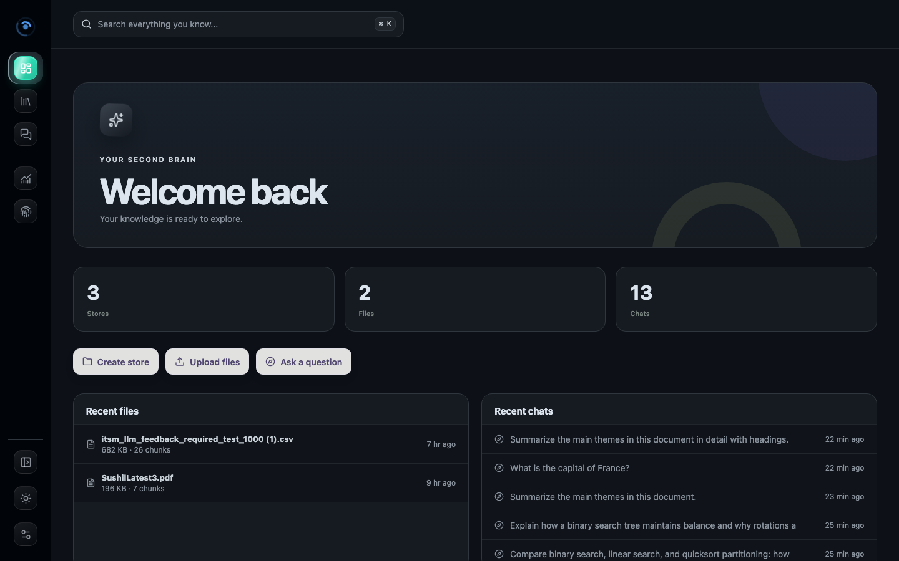
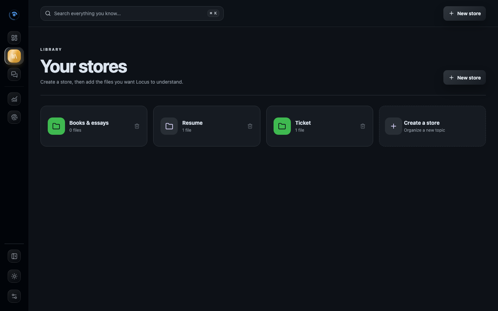
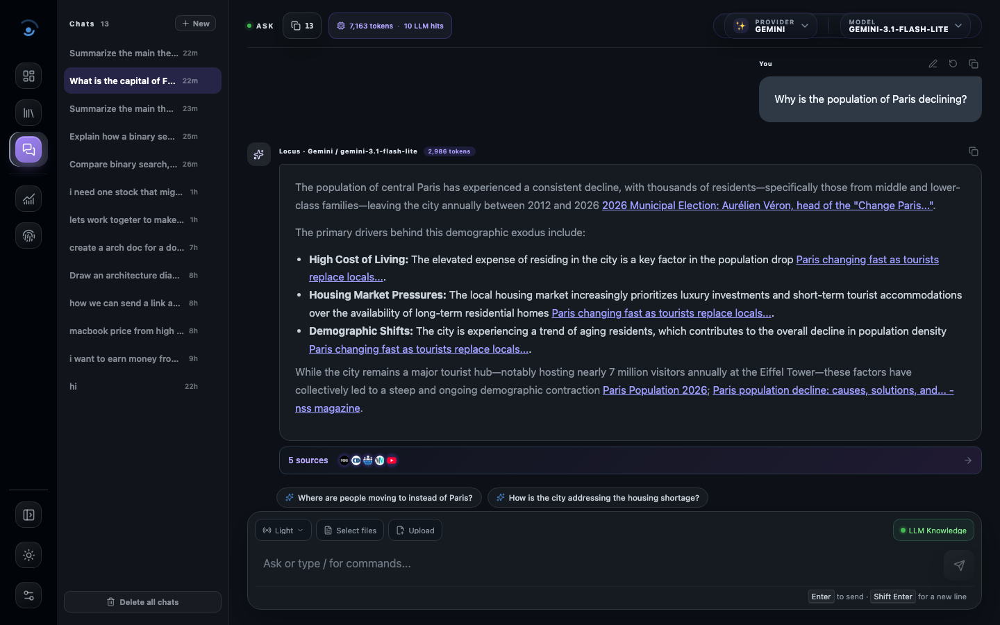

# Locus

**Your knowledge, one question away.**

Locus is a local-first research workspace: upload files, ask questions, and inspect the retrieval pipeline as it works. It pairs a React SPA with a FastAPI backend, local semantic search, and pluggable LLM providers — so you can run it fully offline with Ollama, or plug in Groq, OpenAI, or Gemini.


## Screenshots

| Home | Library |
| --- | --- |
|  |  |

**Ask, with suggested follow-up questions** — after every answer, Locus proposes a few natural next questions so a conversation keeps going without you having to think of what to ask next.



## Features

- **Library** — create stores, upload PDF/DOCX/XLSX/CSV/TXT/MD/JSON/code files, and organize them into collections.
- **Ask** — question your files with selectable evidence scope (all files, none, or specific ones); reopen or delete past chats.
- **Suggested follow-ups** — after each answer, Locus proposes a few relevant next questions as one-click chips.
- **Reasoning modes** — `light` (fast excerpt answers), `thinking` (deep inspection), `deep_summary` (section-by-section), `ticket_analysis` (group incidents by pattern), and more.
- **Multi-provider models** — switch between Ollama (local), Groq, OpenAI, and Gemini, with model presets or custom model IDs.
- **Pipeline trace** — a live developer view of retrieval, request/response previews, and stage-by-stage progress, since Locus is built for people who want to see how the answer was made, not just the answer.
- **Semantic search** — embeddings via fastembed, vector search via pgvector on Postgres (falls back to a plain-cosine SQLite index if no Postgres is configured), no external vector DB required.

See [docs/FEATURES.md](docs/FEATURES.md) for the full list.

## Tech stack

React 19 + Vite (frontend) · FastAPI + SQLAlchemy (backend) · Postgres + pgvector, or SQLite for local dev (storage) · Ollama / Groq / OpenAI / Gemini (LLM providers)

## Prerequisites

- Node.js 18+ and npm
- Python 3.11+ (developed against 3.13)
- (Optional) [Ollama](https://ollama.com) installed locally if you want to run fully offline

## Setup

```bash
git clone https://github.com/realsharadyadav/Locus.git
cd Locus

# Frontend deps
npm install

# Backend: create a virtualenv and install deps
python3 -m venv .venv
.venv/bin/pip install -r backend/requirements.txt

# Configure environment
cp .env.example .env
# edit .env to add API keys if you're using Groq/OpenAI/Gemini
```

## Run

```bash
npm run dev:api                                 # backend on :8000
npm run dev -- --host 127.0.0.1 --port 5173     # frontend on :5173
```

- Frontend: `http://127.0.0.1:5173/`
- Backend: `http://127.0.0.1:8000`
- Health check: `http://127.0.0.1:8000/api/health`

## Tests

```bash
npm run build
.venv/bin/pytest backend/tests
```

## Docs

- [AGENTS.md](AGENTS.md) — architecture, data flow, and internals for anyone (human or AI) working on this codebase
- [docs/ARCHITECTURE.md](docs/ARCHITECTURE.md) — system design
- [docs/FEATURES.md](docs/FEATURES.md) — full feature list
- [docs/UI_DECISIONS.md](docs/UI_DECISIONS.md) — design rationale
- [docs/RUNBOOK.md](docs/RUNBOOK.md) — operational notes

## Contributing

Contributions are welcome. Good places to start:

- Check open [issues](https://github.com/realsharadyadav/Locus/issues), especially any labeled `good first issue`.
- Read [AGENTS.md](AGENTS.md) first — it has the architecture map and file-by-file notes so you don't need to reverse-engineer the codebase.
- Open a PR with a clear description of what changed and why; keep changes focused.

## License

[MIT](LICENSE)
